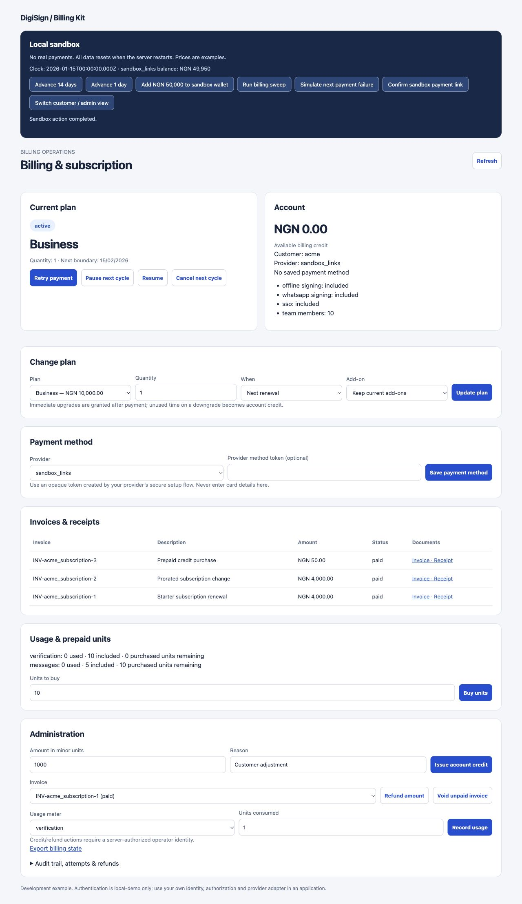

# Local validation — 7 October 2026

- `npm run check`: strict type checking of source/tests/examples, ESM and CommonJS builds, 57 passing tests, and package-export smoke tests.
- `npm run test:local-databases`: two passing real-server adapter suites against local PostgreSQL 14.18 and MongoDB 6.0.6. These include concurrent renewal, interrupted settlement, stale writes, persistent usage/credits/refunds and atomic capacity reservations.
- `npm run format:check`: passed.
- `npm pack --dry-run`: package exports and artifacts verified. Nothing published.
- Browser verification: trial expiry → failed invoice → simulated top-up → successful retry → receipt; immediate upgrade automatically collected and activated; payment-link prepaid purchase remained pending until signed confirmation and then granted units.
- The virtual-time consistency test covers 24 renewal cycles with six overlapping workers, injected failures, credits and cash/invoice invariants.
- Recovery tests cover provider collection followed by lost responses, database interruption after collection, unknown refunds, duplicate webhooks and stale outcomes.

The CI workflow is configured but has not run on GitHub because this repository is local only. Real provider accounts, real wallet ledgers, production email transports and live Trigger deployment have not been connected or tested.

